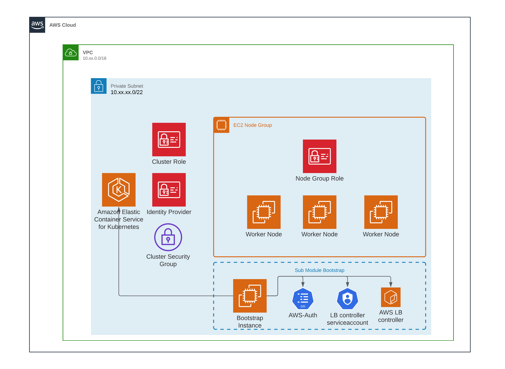

# AWS EKS Terraform Module

Terraform module with create EKS resources on AWS.



## Usage

```terraform
module "eks" {
  source                               = "git::ssh://git@github.com/oozou/terraform-aws-eks.git?ref=v1.0.0"
  name                                 = "example-cluster"
  prefix                               = "oozou"
  environment                          = "test"
  vpc_id                               = "vpc-xxx"
  subnets_ids                          = ["subnet-xxx"]
  is_endpoint_private_access           = true
  is_endpoint_public_access            = false
  admin_role_arns                      = ["arn:xxxx"]
  dev_role_arns                        = ["arn:xxxx"]
  readonly_role_arns                   = ["arn:xxxx"]
  is_config_aws_auth                   = true
  is_create_loadbalancer_controller_sa = true #name: aws-load-balancer-controller
  is_create_argo_image_updater_sa      = true #name: argo-cd-image-updater
  additional_service_accounts          = [{
    name                 = "argo-cd-image-updater2"
    namespace            = "argocd"
    existing_policy_arns = ["arn:aws:iam::aws:policy/AmazonEC2ContainerRegistryReadOnly"]
  }]
  aws_account = {
    access_key = "xxxx"
    secret_key = "xxx"
    region     = "ap-southeast-1"
  }
  tags = {
    "key" = "value"
  }
}
```

<!-- BEGIN_TF_DOCS -->
## Requirements

| Name | Version |
|------|---------|
| <a name="requirement_terraform"></a> [terraform](#requirement\_terraform) | >= 1.0.0 |
| <a name="requirement_aws"></a> [aws](#requirement\_aws) | >= 4.0.0 |
| <a name="requirement_tls"></a> [tls](#requirement\_tls) | 3.2.1 |

## Providers

| Name | Version |
|------|---------|
| <a name="provider_aws"></a> [aws](#provider\_aws) | 4.10.0 |

## Modules

| Name | Source | Version |
|------|--------|---------|
| <a name="module_bootstrap"></a> [bootstrap](#module\_bootstrap) | ./modules/bootstrap | n/a |
| <a name="module_openid_connect"></a> [openid\_connect](#module\_openid\_connect) | ./modules/openid_connect_provider | n/a |

## Resources

| Name | Type |
|------|------|
| [aws_eks_addon.vpc_cni](https://registry.terraform.io/providers/hashicorp/aws/latest/docs/resources/eks_addon) | resource |
| [aws_eks_cluster.this](https://registry.terraform.io/providers/hashicorp/aws/latest/docs/resources/eks_cluster) | resource |
| [aws_eks_node_group.this](https://registry.terraform.io/providers/hashicorp/aws/latest/docs/resources/eks_node_group) | resource |
| [aws_iam_role.cluster_role](https://registry.terraform.io/providers/hashicorp/aws/latest/docs/resources/iam_role) | resource |
| [aws_iam_role.node_group_role](https://registry.terraform.io/providers/hashicorp/aws/latest/docs/resources/iam_role) | resource |
| [aws_iam_role_policy_attachment.amazon_ec2_container_registry_readonly](https://registry.terraform.io/providers/hashicorp/aws/latest/docs/resources/iam_role_policy_attachment) | resource |
| [aws_iam_role_policy_attachment.amazon_eks_cluster_policy](https://registry.terraform.io/providers/hashicorp/aws/latest/docs/resources/iam_role_policy_attachment) | resource |
| [aws_iam_role_policy_attachment.amazon_eks_cni_policy](https://registry.terraform.io/providers/hashicorp/aws/latest/docs/resources/iam_role_policy_attachment) | resource |
| [aws_iam_role_policy_attachment.amazon_eks_vpc_resource_controller](https://registry.terraform.io/providers/hashicorp/aws/latest/docs/resources/iam_role_policy_attachment) | resource |
| [aws_iam_role_policy_attachment.amazon_eks_worker_node_policy](https://registry.terraform.io/providers/hashicorp/aws/latest/docs/resources/iam_role_policy_attachment) | resource |
| [aws_security_group.cluster](https://registry.terraform.io/providers/hashicorp/aws/latest/docs/resources/security_group) | resource |
| [aws_security_group_rule.eks_egress_allow_all](https://registry.terraform.io/providers/hashicorp/aws/latest/docs/resources/security_group_rule) | resource |
| [aws_security_group_rule.eks_ingress_allow_tls](https://registry.terraform.io/providers/hashicorp/aws/latest/docs/resources/security_group_rule) | resource |
| [aws_iam_policy_document.cluster_role](https://registry.terraform.io/providers/hashicorp/aws/latest/docs/data-sources/iam_policy_document) | data source |
| [aws_iam_policy_document.node_group_role](https://registry.terraform.io/providers/hashicorp/aws/latest/docs/data-sources/iam_policy_document) | data source |
| [aws_vpc.this](https://registry.terraform.io/providers/hashicorp/aws/latest/docs/data-sources/vpc) | data source |

## Inputs

| Name | Description | Type | Default | Required |
|------|-------------|------|---------|:--------:|
| <a name="input_additional_addons"></a> [additional\_addons](#input\_additional\_addons) | additional addons for eks cluster | `list(string)` | <pre>[<br>  "vpc-cni"<br>]</pre> | no |
| <a name="input_additional_allow_cidr"></a> [additional\_allow\_cidr](#input\_additional\_allow\_cidr) | cidr for allow connection to eks cluster | `list(string)` | `[]` | no |
| <a name="input_additional_service_accounts"></a> [additional\_service\_accounts](#input\_additional\_service\_accounts) | additional service account to access eks | <pre>list(object({<br>    name                 = string<br>    namespace            = string<br>    existing_policy_arns = list(string)<br>  }))</pre> | `[]` | no |
| <a name="input_admin_role_arns"></a> [admin\_role\_arns](#input\_admin\_role\_arns) | admin role arns for grant permission to aws-auth | `list(string)` | `[]` | no |
| <a name="input_aws_account"></a> [aws\_account](#input\_aws\_account) | AWS Credentials to access AWS by bootstrap module | <pre>object({<br>    region     = string,<br>    access_key = string,<br>    secret_key = string<br>  })</pre> | n/a | yes |
| <a name="input_dev_role_arns"></a> [dev\_role\_arns](#input\_dev\_role\_arns) | dev role arns for grant permission to aws-auth | `list(string)` | `[]` | no |
| <a name="input_eks_version"></a> [eks\_version](#input\_eks\_version) | Desired Kubernetes version. Downgrades are not supported by EKS. | `string` | `null` | no |
| <a name="input_environment"></a> [environment](#input\_environment) | To manage a resources with tags | `string` | n/a | yes |
| <a name="input_is_config_aws_auth"></a> [is\_config\_aws\_auth](#input\_is\_config\_aws\_auth) | require if create lb controler | `bool` | `true` | no |
| <a name="input_is_create_argo_image_updater_sa"></a> [is\_create\_argo\_image\_updater\_sa](#input\_is\_create\_argo\_image\_updater\_sa) | is create default role with permission for argo-cd image updater (name : argo-cd-image-updater) | `bool` | `true` | no |
| <a name="input_is_create_bootstrap"></a> [is\_create\_bootstrap](#input\_is\_create\_bootstrap) | if true will create bootstrap for config aws-auth | `bool` | `true` | no |
| <a name="input_is_create_cluster_autoscaler_sa"></a> [is\_create\_cluster\_autoscaler\_sa](#input\_is\_create\_cluster\_autoscaler\_sa) | is create default role with permission for eks cluster autoscaler | `bool` | `true` | no |
| <a name="input_is_create_loadbalancer_controller_sa"></a> [is\_create\_loadbalancer\_controller\_sa](#input\_is\_create\_loadbalancer\_controller\_sa) | is create default role with permission for aws loadbalancer controller (name : aws-load-balancer-controller) | `bool` | `true` | no |
| <a name="input_is_create_open_id_connect"></a> [is\_create\_open\_id\_connect](#input\_is\_create\_open\_id\_connect) | if true will create oidc provider and iam role for service account | `bool` | `true` | no |
| <a name="input_is_endpoint_private_access"></a> [is\_endpoint\_private\_access](#input\_is\_endpoint\_private\_access) | Whether the Amazon EKS private API server endpoint is enabled | `bool` | `true` | no |
| <a name="input_is_endpoint_public_access"></a> [is\_endpoint\_public\_access](#input\_is\_endpoint\_public\_access) | Whether the Amazon EKS public API server endpoint is enabled | `bool` | `false` | no |
| <a name="input_name"></a> [name](#input\_name) | The Name of the EKS cluster | `string` | n/a | yes |
| <a name="input_node_groups"></a> [node\_groups](#input\_node\_groups) | EKS Node Group for create EC2 as worker node | <pre>list(object({<br>    name              = string<br>    desired_size      = number<br>    max_size          = number<br>    min_size          = number<br>    max_unavailable   = number<br>    ami_type          = string<br>    is_spot_instances = bool<br>    disk_size         = number<br>    labels            = map(any) #for kubernetes api<br>    instance_types    = list(string)<br>  }))</pre> | <pre>[<br>  {<br>    "ami_type": "AL2_x86_64",<br>    "desired_size": 1,<br>    "disk_size": 20,<br>    "instance_types": [<br>      "t3.medium"<br>    ],<br>    "is_spot_instances": false,<br>    "labels": {<br>      "default_nodegroup_labels": "default-nodegroup"<br>    },<br>    "max_size": 1,<br>    "max_unavailable": 1,<br>    "min_size": 1,<br>    "name": "default"<br>  }<br>]</pre> | no |
| <a name="input_prefix"></a> [prefix](#input\_prefix) | The prefix name of customer to be displayed in AWS console and resource | `string` | n/a | yes |
| <a name="input_readonly_role_arns"></a> [readonly\_role\_arns](#input\_readonly\_role\_arns) | readonly role group arns for grant permission to aws-auth | `list(string)` | `[]` | no |
| <a name="input_subnets_ids"></a> [subnets\_ids](#input\_subnets\_ids) | List of IDs of subnets for create EKS | `list(string)` | n/a | yes |
| <a name="input_tags"></a> [tags](#input\_tags) | Tag for a resource that create by this component | `map(string)` | `{}` | no |
| <a name="input_vpc_id"></a> [vpc\_id](#input\_vpc\_id) | The ID of the VPC for create security group | `string` | n/a | yes |

## Outputs

| Name | Description |
|------|-------------|
| <a name="output_cluster_name"></a> [cluster\_name](#output\_cluster\_name) | Name of the cluster |
| <a name="output_endpoint"></a> [endpoint](#output\_endpoint) | cluster endpoint for EKS |
| <a name="output_kubeconfig_certificate_authority_data"></a> [kubeconfig\_certificate\_authority\_data](#output\_kubeconfig\_certificate\_authority\_data) | kubeconfig certificate |
| <a name="output_openid_connect_provider_arn"></a> [openid\_connect\_provider\_arn](#output\_openid\_connect\_provider\_arn) | arn of oidc provider |
| <a name="output_service_account_role_arns"></a> [service\_account\_role\_arns](#output\_service\_account\_role\_arns) | created role arn for create service accounts in cluster |
<!-- END_TF_DOCS -->
